<div align="center">

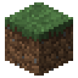

# MineGuia

### Minecraft explicado bloco a bloco

Guias rápidos e visuais para quem quer entender o Minecraft de verdade:<br>
imagens dos itens do próprio jogo, números conferidos e uma interface que parece um inventário.


</div>

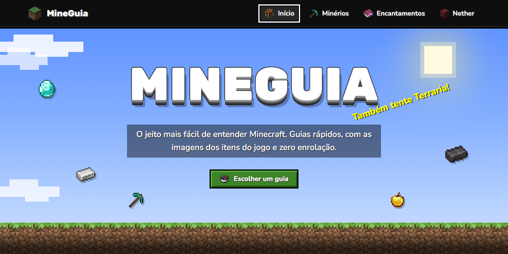

## Sumário

- [A proposta](#a-proposta)
- [O que tem no site](#o-que-tem-no-site)
- [Página inicial e as abas](#página-inicial-e-as-abas)
- [Guia até o Topo](#guia-até-o-topo)
- [Calculadora de kit](#calculadora-de-kit)
- [Receitas e dicas](#receitas-e-dicas)
- [Trocas com os aldeões](#trocas-com-os-aldeões)
- [Encantamentos sem mistério](#encantamentos-sem-mistério)
- [Rumo ao Nether](#rumo-ao-nether)
- [No celular](#no-celular)
- [Identidade visual](#identidade-visual)
- [Como rodar](#como-rodar)
- [Como publicar no GitHub Pages](#como-publicar-no-github-pages)
- [Estrutura do projeto](#estrutura-do-projeto)
- [Como editar e crescer o site](#como-editar-e-crescer-o-site)
- [De onde vêm os dados](#de-onde-vêm-os-dados)
- [Próximos guias](#próximos-guias)
- [Tecnologias](#tecnologias)
- [Autor e créditos](#autor-e-créditos)

## A proposta

Minecraft é enorme, e quase tudo nele depende de saber **o que fazer, com o quê e quanto**. Quantos diamantes uma armadura completa pede? Em que altura o ferro aparece mais? Que picareta quebra os detritos ancestrais? Na hora de jogar, essas respostas costumam estar espalhadas em páginas longas, vídeos de vinte minutos ou tabelas difíceis de ler.

O **MineGuia** junta essas respostas em guias curtos, organizados por assunto. A ideia é que qualquer pessoa — de quem acabou de socar a primeira árvore a quem já está indo atrás de netherite — encontre o que precisa em poucos segundos e entenda sem esforço.

O projeto segue seis princípios:

- **Direto ao ponto.** Cada guia responde perguntas práticas do jogo, com números e passos claros, sem textão.
- **Visual de Minecraft.** Painéis de inventário, slots, botões de pedra, tooltips roxas e "conquistas" no canto da tela. Quem joga se sente em casa.
- **Imagens reais.** Todos os itens, blocos e texturas são os do próprio jogo, então você reconhece na hora o que precisa procurar.
- **Números confiáveis.** Custos, proteção, durabilidade e alturas conferidos na Minecraft Wiki (Java Edition).
- **Descontraído.** Frase amarela pulsando como na tela inicial do jogo, um creeper que "explode" a sua lista e conquistas quando você completa um conjunto.
- **Para qualquer tela.** Funciona no celular, no tablet e no computador — e até sem servidor, abrindo o arquivo direto.

## O que tem no site

| Parte | O que faz |
|:--|:--|
| **Página inicial** | Céu do Minecraft com o logo e as **abas**: cada aba é um guia, com título, descrição e uma ilustração montada com itens reais. |
| **Guia até o Topo** | Do cobre à netherite: quanto minério cada armadura e cada ferramenta pedem, onde achar cada minério, que picareta usar e o passo a passo da netherite. |
| **Calculadora de kit** | Você marca as peças que quer e ela soma só o que você precisa — até o carvão da fornalha. |
| **Receitas** | A posição de cada item na grade 3×3 da bancada e os upgrades na mesa de ferraria. |
| **Trocas com os aldeões** | O que cada um dos 13 profissionais e o mercador ambulante faz, a estação de trabalho de cada um e todas as trocas em ordem, do nível Novato ao Mestre. |
| **Encantamentos sem mistério** | O melhor encantamento para cada item com um clique, como usar a mesa de encantamentos, a bigorna e o rebolo, e todos os 43 encantamentos do jogo, nível por nível. |
| **Rumo ao Nether** | Os 5 biomas do Nether e os mobs de cada um, as 4 estruturas com tudo o que vem nos baús e um guia rápido que leva direto ao bioma ou à estrutura. |
| **Dicas e curiosidades** | Truques de mineração e fatos divertidos do jogo. |

## Página inicial e as abas

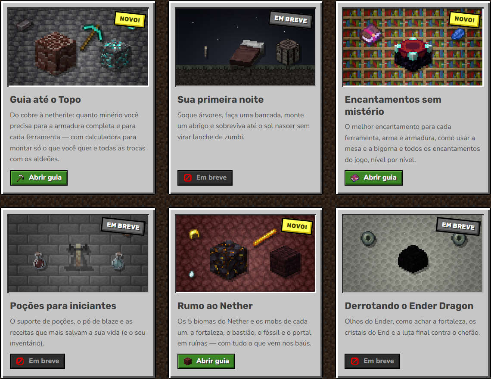

- **Céu com chão de grama.** Nuvens andando, sol quadrado e uma fileira de blocos de grama. Ao rolar a página, você "desce" para a terra.
- **Frase amarela.** Pulsa ao lado do logo, igual à tela inicial do jogo. São 18 frases diferentes; clique nela para trocar.
- **Abas dos guias.** Os guias prontos (Guia até o Topo e Encantamentos sem mistério) ganham o selo "NOVO!". Os próximos aparecem como "EM BREVE", com a ilustração em tons apagados e um bloco de barreira no botão.
- **Placa "Você sabia?"** Feita com a textura de tábuas de carvalho, mostra curiosidades do jogo que mudam com um clique.
- **Rodapé de bedrock.** O fundo do mundo é o fim da página.

## Guia até o Topo

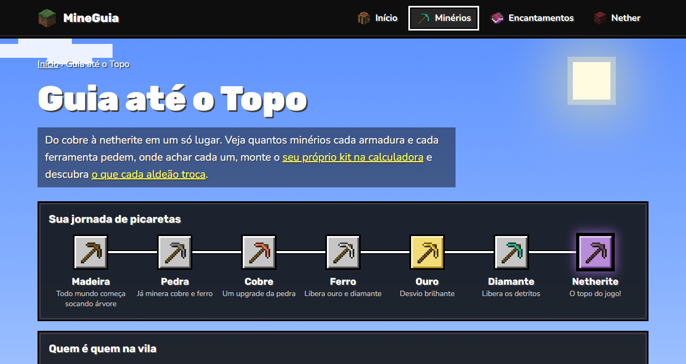

O primeiro guia leva o jogador da picareta de madeira até o material mais forte do jogo, a **netherite**. A página funciona como uma descida pelo subsolo: cada minério fica numa "camada" com a textura de onde ele aparece (pedra, ardósia ou netherrack) e uma etiqueta com a melhor altura para minerar.

### A jornada das picaretas

No topo, uma trilha mostra a ordem de progresso e o que cada picareta libera:

**Madeira → Pedra → Cobre → Ferro → Ouro (desvio) → Diamante → Netherite**

Clicar num minério da trilha leva direto à seção dele.

### A regra que vale para quase tudo

A receita de cada peça é a mesma para cobre, ferro, ouro e diamante — só troca o material:

| Peça | Material | Gravetos |
|:--|:-:|:-:|
| Capacete | 5 | — |
| Peitoral | 8 | — |
| Calças | 7 | — |
| Botas | 4 | — |
| **Armadura completa** | **24** | — |
| Espada | 2 | 1 |
| Picareta | 3 | 2 |
| Machado | 3 | 2 |
| Pá | 1 | 2 |
| Enxada | 2 | 2 |
| Lança *(nova na versão 1.21.11)* | 1 | 2 |
| **Todas as ferramentas e armas** | **12** | **11** |

### Um card para cada minério

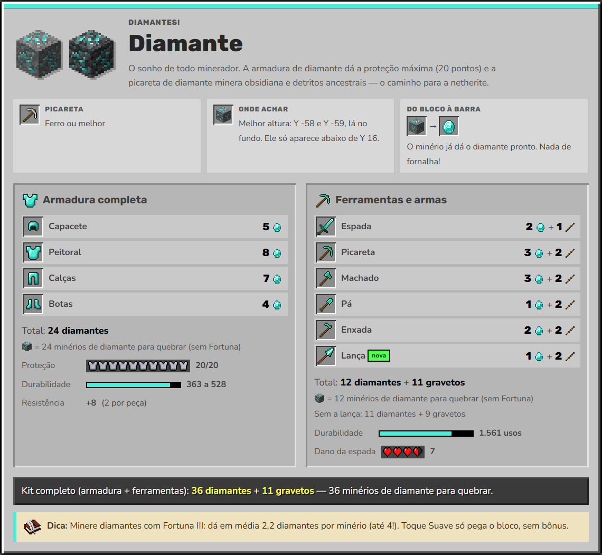

Cada card mostra:

- as peças de armadura e de ferramenta, com o custo de cada uma e os totais;
- quantos blocos de minério você precisa quebrar (o cobre, por exemplo, dá de 2 a 5 itens por bloco, então pede bem menos blocos);
- a picareta mínima, onde achar e como o bloco vira barra (minério → bruto → fornalha → barra);
- a proteção com os ícones de armadura do próprio jogo, a durabilidade e o dano da espada em corações;
- o custo do kit completo e uma dica.

| Material | Melhor altura | Picareta mínima | Proteção | Durabilidade (armadura) | Durabilidade (ferramentas) | Dano da espada |
|:--|:--|:--|:-:|:-:|:-:|:-:|
| Cobre | Y 48 | Pedra | 11/20 | 121 a 176 | 190 | 5 |
| Ferro | Y 16 (ou Y 232, nas montanhas) | Pedra | 15/20 | 165 a 240 | 250 | 6 |
| Ouro | Y -16 (nas Badlands, de Y 32 a 256) | Ferro | 11/20 | 77 a 112 | 32 | 4 |
| Diamante | Y -58 e Y -59 | Ferro | 20/20 | 363 a 528 | 1.561 | 7 |
| Netherite | Nether, de Y 8 a 24 (melhor: Y 16) | Diamante | 20/20 | 407 a 592 | 2.031 | 8 |

### Netherite, passo a passo

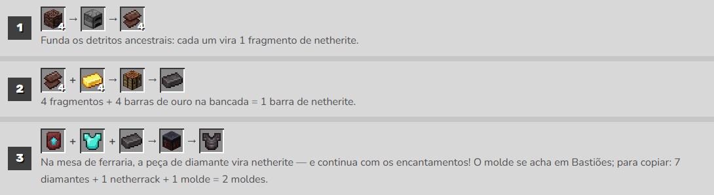

A netherite não é craftada do zero: ela é um **upgrade** do equipamento de diamante.

1. Funda **4 detritos ancestrais** na fornalha → 4 fragmentos de netherite.
2. **4 fragmentos + 4 barras de ouro** na bancada → 1 barra de netherite.
3. Na **mesa de ferraria**: molde de melhoria + peça de diamante + barra de netherite → peça de netherite (e os encantamentos continuam!).

O molde de melhoria é encontrado nos Bastiões do Nether e pode ser copiado: **7 diamantes + 1 netherrack + 1 molde = 2 moldes**.

### Tooltips como as do jogo

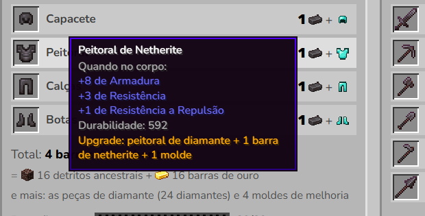

Passe o mouse (ou navegue com o teclado) por qualquer item para ver uma tooltip roxa no estilo do Minecraft, com proteção, resistência, durabilidade, dano e custo.

## Calculadora de kit

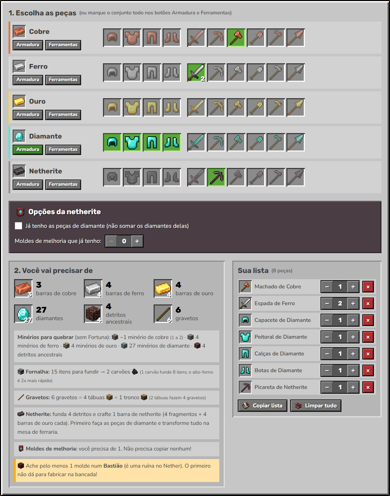

Logo abaixo das quantidades, a calculadora responde à pergunta "e se eu quiser só algumas peças?".

- **50 peças para escolher.** São 5 materiais × 10 peças (4 de armadura e 6 ferramentas e armas). Clique para marcar e de novo para tirar — ou marque o conjunto inteiro nos botões **Armadura** e **Ferramentas**.
- **Quantidades.** Na lista, aumente ou diminua cada peça (até 64, um pack).
- **Resultado.** Os recursos aparecem em slots de inventário, com a contagem em packs (130 = 2 packs + 2), e mais:
  - quantos blocos de minério quebrar (sem Fortuna);
  - quantos itens fundir e quantos **carvões** a fornalha vai gastar;
  - quantos gravetos, tábuas e troncos;
  - o passo a passo da netherite e quantos **moldes** copiar.
- **Opções da netherite.** "Já tenho as peças de diamante" e "moldes de melhoria que já tenho" ajustam a conta.
- **Copiar lista.** Copia tudo em texto para colar no chat com os amigos.
- **Limpar tudo.** Com direito a um creeper explodindo a lista.
- **Conquistas.** Completar um conjunto mostra um aviso no canto da tela, como no jogo ("Cubra-me de diamantes", "Amigo dos Piglins"...).
- **Memória.** A lista fica salva no navegador: volte depois e ela continua lá.

> **Exemplo:** armadura completa de netherite começando do zero (achando 1 molde no Bastião) pede **16 detritos ancestrais, 16 barras de ouro, 45 diamantes** (24 para a armadura de diamante e 21 para copiar 3 moldes) **e 3 netherrack**.

## Receitas e dicas

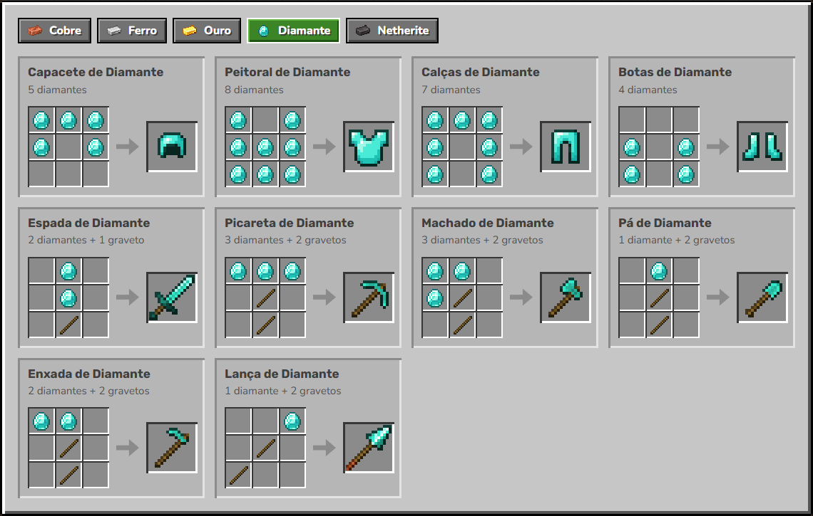

- **Como montar cada peça.** Escolha o material e veja a posição de cada item na grade 3×3 da bancada. Na opção netherite aparecem a receita da barra, a cópia do molde e os upgrades da mesa de ferraria.
- **Dicas de minerador.** Não cavar para baixo, levar um balde d'água, tochas sempre à direita, Fortuna III nos diamantes, alto-forno 2x mais rápido e a netherite que boia na lava.

## Trocas com os aldeões

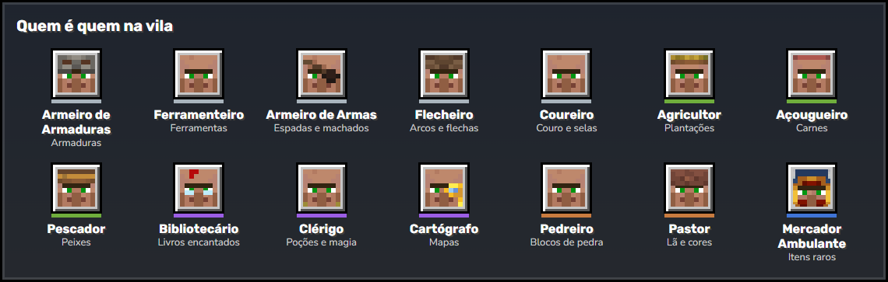

Logo abaixo da trilha de picaretas, o painel **Quem é quem na vila** funciona do mesmo jeito: clique em um aldeão e a página abre o card dele e rola até lá. O link fica no endereço (por exemplo, `minerios.html#aldeao-bibliotecario`), então dá para mandar direto para um amigo.

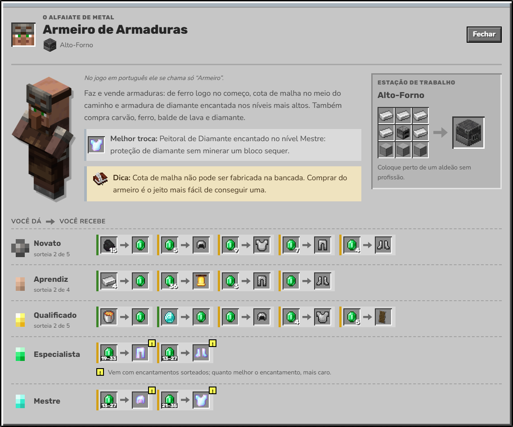

- **Como funcionam as trocas.** Um resumo de como contratar um aldeão, como o sorteio das ofertas funciona, quando eles reabastecem, como conseguir descontos e os 5 níveis (Novato, Aprendiz, Qualificado, Especialista e Mestre), com as insígnias do jogo.
- **Um card por aldeão,** organizados em grupos: equipamento, comida, magia e mapas, construção e o visitante. Cada card mostra o que ele faz, a melhor troca, uma dica e a **estação de trabalho com a receita** na bancada.
- **Todas as trocas em ordem,** nível por nível, no formato "você dá → você recebe". Verde é quando você ganha esmeraldas e dourado quando gasta; itens encantados brilham como no jogo e as trocas com detalhes extras (livro encantado, mapas, cores sorteadas) ganham uma observação.
- **Mercador ambulante** com o que ele compra, as ofertas especiais e a lojinha de ofertas comuns organizada por preço.
- Os nomes são os oficiais do jogo em português. Detalhe curioso: o Armorer e o Weaponsmith se chamam os dois "Armeiro" no jogo, por isso aqui eles aparecem como Armeiro de Armaduras e Armeiro de Armas.

## Encantamentos sem mistério

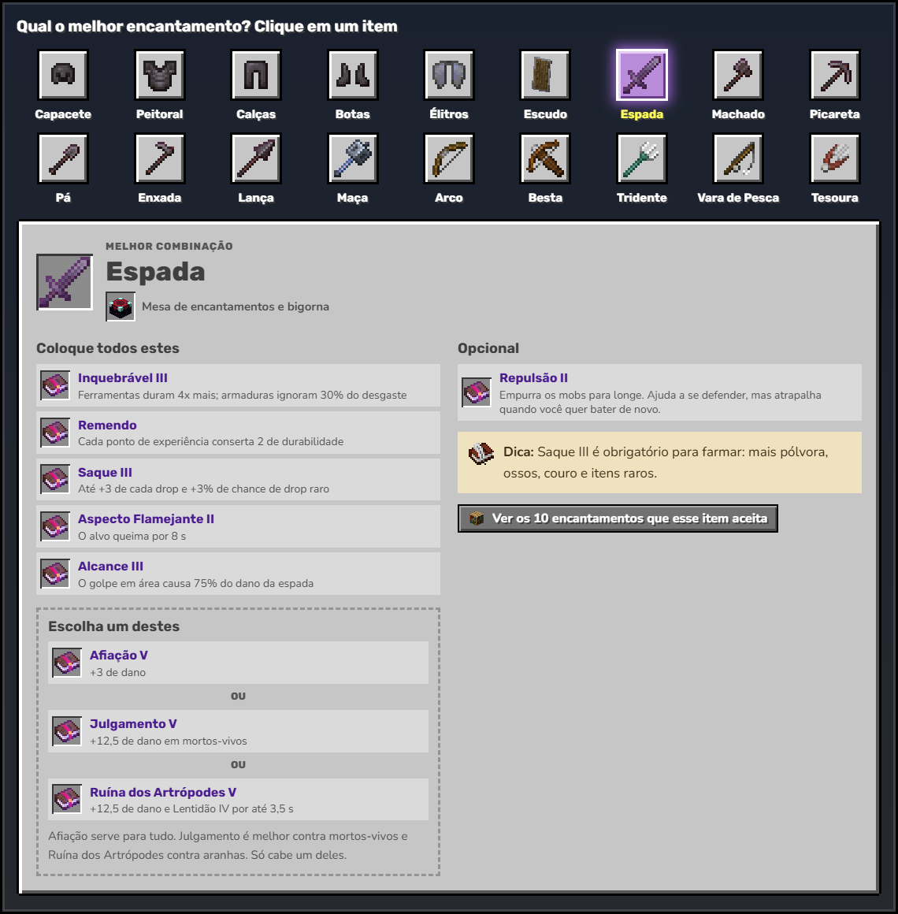

A segunda aba do site, em `encantamentos.html`.

- **Qual o melhor encantamento?** No topo, 18 itens para clicar: as quatro peças de armadura, élitros, escudo, espada, machado, picareta, pá, enxada, lança, maça, arco, besta, tridente, vara de pesca e tesoura. O item escolhido mostra a combinação ideal, o que pode escolher entre dois encantamentos que não combinam (como Multidisparo ou Perfuração na besta), os opcionais, uma dica e se ele vai na mesa de encantamentos ou só na bigorna. O link fica no endereço (por exemplo, `encantamentos.html#melhor-espada`).
- **Como encantar.** A mesa de encantamentos com a receita e a posição das 15 estantes, a bigorna (e o famoso "Muito caro!"), onde conseguir livros encantados, o rebolo para tirar encantamentos e como ler os números romanos.
- **Todos os encantamentos.** Os 43 encantamentos do jogo, separados por tipo de item e em ordem de nível máximo, do menor para o maior (ou de A a Z). Cada card mostra o que faz, em quais itens funciona, o efeito de cada nível do I ao máximo, com quais não combina e, nos encantamentos de tesouro, onde conseguir. Dá para filtrar a lista por item.

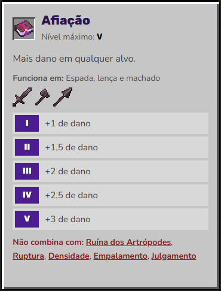

As combinações recomendadas partiram de uma imagem de "melhores encantamentos", mas foram conferidas com os arquivos do jogo e corrigidas onde ela errava: Repulsão vai só até o nível II, Peso-Pena e Passos Profundos são só das botas, Multidisparo não combina com Perfuração, Densidade não combina com Ruptura e Correnteza não combina com Lealdade nem com Condutividade.

## Rumo ao Nether

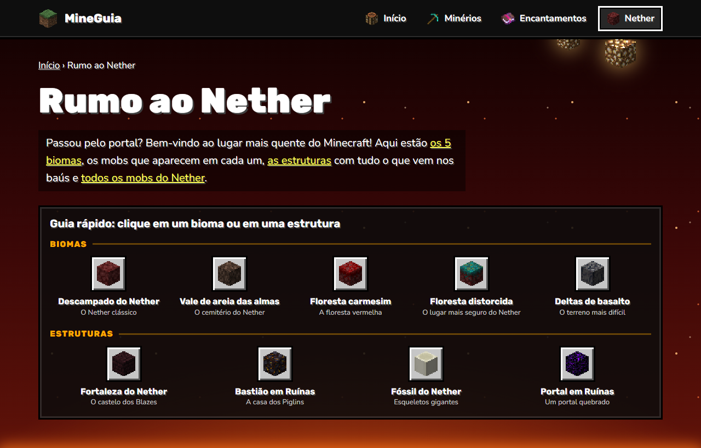

A terceira aba do site, em `nether.html`, com o céu vermelho, as faíscas subindo da lava e a pedra-luminosa pendurada no teto.

- **Guia rápido.** No topo, os 5 biomas e as 4 estruturas em ícones. Um clique leva direto ao card escolhido, que pisca para você achar na hora. O link fica no endereço (por exemplo, `nether.html#estrutura-bastiao`).
- **Os biomas.** Descampado do Nether, Vale de areia das almas, Floresta carmesim, Floresta distorcida e Deltas de basalto. Cada card tem uma captura de tela do jogo, o que tem por lá, o nível de perigo, a cor da neblina, os blocos que você encontra, as estruturas que podem aparecer e uma dica. Os mobs vêm do mais comum para o mais raro, com a frequência marcada (muito comum, comum, pouco comum, raro) — e o Marchador aparece "na lava".
- **As estruturas.** Fortaleza do Nether, Bastião em Ruínas, Fóssil do Nether e Portal em Ruínas: onde cada uma aparece, os mobs que moram lá, os destaques (geradores de Blaze, o molde de melhoria de netherita, o Ghast Seco...) e **o que vem nos baús**, com a quantidade e a chance de cada item. O bastião tem 4 tipos de baú, um em cada aba: sala do tesouro, ponte, estábulo de Hoglins e os outros baús.
- **Os mobs.** Os 11 mobs do Nether separados em passivos, neutros e hostis, com o que fazem, onde aparecem e o que podem soltar.

Os mobs, os biomas e as estruturas são chips clicáveis: do bioma você vai para o mob, do mob para a estrutura e assim por diante.

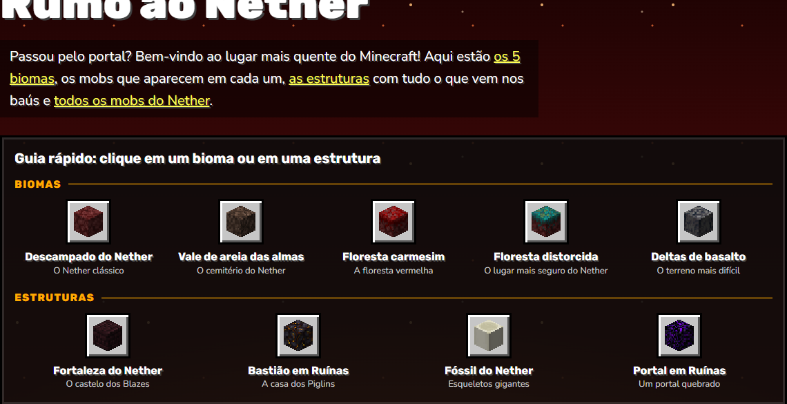

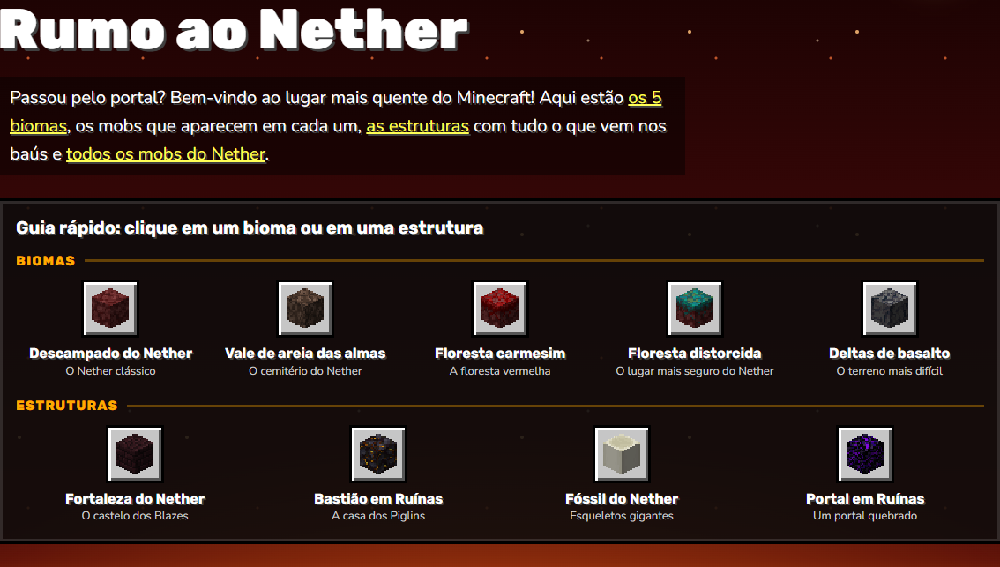

## No celular

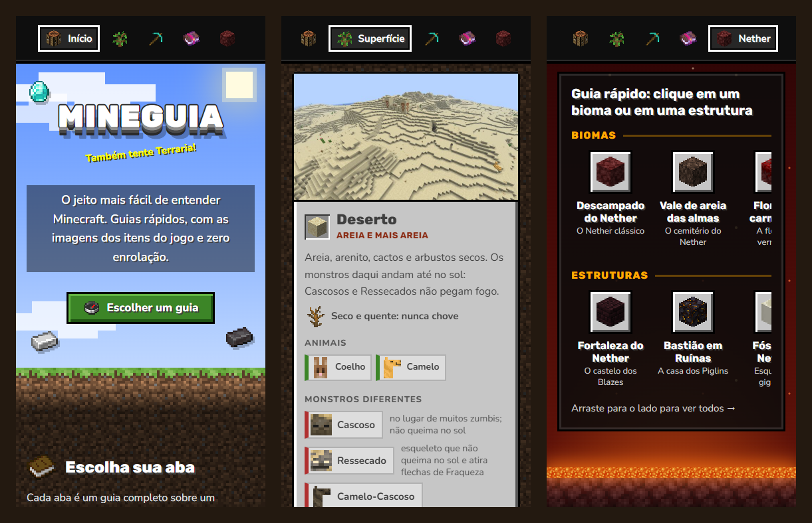

O layout se adapta de 320 px até telas grandes. A trilha de picaretas, o painel dos aldeões, o seletor de encantamentos e o guia rápido do Nether viram faixas que deslizam para o lado, o menu mostra só os ícones (e o nome da página atual), os cards e a calculadora se empilham e os slots diminuem para caber na tela, sem rolagem lateral.

## Identidade visual

- **Interface de inventário.** Painéis cinza com relevo e cantos "pixelados", slots afundados, botões de pedra que ganham borda branca ao passar o mouse e botões verdes para as ações principais.
- **Texturas reais como cenário.** Terra escurecida no fundo (como na tela de opções do jogo), pedra, ardósia e netherrack nas camadas dos minérios, tábuas de carvalho na calculadora e bedrock no rodapé.
- **Pixel art nítida.** Todas as imagens usam `image-rendering: pixelated` e aparecem em múltiplos de 16 px.
- **Cores do jogo.** O amarelo da frase da tela inicial, o roxo das tooltips, o azul dos atributos e o dourado dos custos.
- **Fontes legíveis.** Rubik nos títulos e no logo, Nunito nos textos — as duas com números bem claros.

### Acessibilidade e desempenho

- Dá para usar tudo pelo teclado, com foco visível; os slots da calculadora são botões com `aria-pressed`.
- As imagens que trazem informação têm texto alternativo; as ilustrações decorativas ficam escondidas dos leitores de tela.
- Respeita a opção "reduzir movimento" do sistema, desligando nuvens, itens boiando e animações.
- É leve: 461 imagens que somam cerca de 1 MB, sem frameworks e sem etapa de build.

## Como rodar

Não precisa instalar nada.

```bash
git clone git@github.com:AllanFreire/SITE-MINECRAFT.git
cd SITE-MINECRAFT
```

Depois é só abrir o `index.html` no navegador (duplo clique). Tudo funciona assim, inclusive a calculadora e a lista salva.

Se preferir usar um servidor local:

```bash
# com Python
python -m http.server 8000

# ou com Node.js
npx serve .
```

E acesse `http://localhost:8000` (ou o endereço que o `serve` mostrar).

> A internet só é usada para carregar as fontes do Google Fonts. Sem conexão, o site usa as fontes do sistema.

## Como publicar no GitHub Pages

O site é 100% estático, então pode ser publicado direto deste repositório (o GitHub Pages é gratuito para repositórios públicos):

1. No GitHub, abra **Settings → Pages**.
2. Em **Source**, escolha **Deploy from a branch**.
3. Selecione a branch **main**, a pasta **/ (root)** e clique em **Save**.

Em alguns minutos o site fica no ar em `https://allanfreire.github.io/SITE-MINECRAFT/`.

## Estrutura do projeto

```text
SITE-MINECRAFT/
├── index.html             Página inicial: céu, logo, abas dos guias e curiosidades
├── minerios.html          Guia até o Topo: quantidades, calculadora, receitas, aldeões e dicas
├── encantamentos.html     Encantamentos sem mistério: melhor combinação por item, como encantar e todos os encantamentos
├── nether.html            Rumo ao Nether: guia rápido, biomas, estruturas com os baús e mobs
├── css/
│   ├── style.css          Estilo global: cores, painéis, slots, botões, tooltip, conquistas e página inicial
│   ├── minerios.css       Estilo do guia, das camadas de minério, da calculadora e das receitas
│   ├── aldeoes.css        Estilo do painel da vila e dos cards dos aldeões
│   ├── encantamentos.css  Estilo da página de encantamentos
│   └── nether.css         Estilo da página do Nether: céu vermelho, cards dos biomas e das estruturas, baús e mobs
├── js/
│   ├── main.js            Usado em todas as páginas: frase amarela, tooltips, conquistas e curiosidades
│   ├── dados-minerios.js  Todos os números e textos do guia (é aqui que se edita)
│   ├── minerios.js        Monta o guia, a calculadora e as receitas a partir dos dados
│   ├── dados-aldeoes.js   Todas as trocas dos aldeões, uma por linha, com os nomes oficiais em português
│   ├── aldeoes.js         Monta o painel da vila e os cards dos aldeões
│   ├── dados-encantamentos.js  Todos os encantamentos e as melhores combinações por item
│   ├── encantamentos.js   Monta o seletor, a seção "Como encantar" e a lista com filtro e ordem
│   ├── dados-nether.js    Biomas, mobs, estruturas e o que vem em cada baú do Nether
│   └── nether.js          Monta o guia rápido, os cards dos biomas, das estruturas e dos mobs
├── assets/img/
│   ├── itens/             Ícones de itens e blocos, com o ID do jogo no nome (ex.: diamond_sword.png)
│   ├── texturas/          Texturas de fundo: terra, pedra, ardósia, netherrack, tijolos do Nether, lava, bedrock...
│   ├── nether/            Capturas de tela dos biomas e das estruturas e o rosto de cada mob do Nether
│   ├── aldeoes/           Retrato e rosto de cada aldeão
│   └── gui/               Ícones do HUD (armadura e corações) e insígnias de nível dos aldeões
└── docs/img/              Imagens deste README
```

## Como editar e crescer o site

### Mudar números e textos do guia

Tudo o que aparece no Guia até o Topo — cards, calculadora e receitas — é gerado a partir de `js/dados-minerios.js`. Mudou um número lá, ele muda no site inteiro.

- `pecas`: as 10 peças, com o custo em material, os gravetos e o desenho na bancada (`M` = material, `G` = graveto, `.` = vazio).
- `materiais`: um objeto por material, do mais fraco ao mais forte.

<details>
<summary>Exemplo de um material</summary>

```js
{
  id: "ferro",                  // âncora da seção: minerios.html#ferro
  prefixo: "iron",              // começo do nome das imagens: iron_helmet.png, iron_sword.png...
  nome: "Ferro",
  cor: "#d8d8d8",               // faixa do card, etiqueta de profundidade e barras
  textura: "tx-pedra",          // fundo da camada (classes .tx-* em css/style.css)
  profundidade: "Y 16",
  material: { id: "iron_ingot", sing: "barra de ferro", plur: "barras de ferro" },
  drop: [1, 1],                 // itens por bloco de minério, sem Fortuna: [mínimo, máximo]
  picareta: { id: "stone_pickaxe", texto: "Pedra (ou cobre) ou melhor" },
  protecao: [2, 6, 5, 2],       // capacete, peitoral, calças, botas
  durArmadura: [165, 240, 225, 195],
  durFerramenta: 250,
  danoEspada: 6,
  conquistas: { armadura: "Vestido de ferro", ferramentas: "Hora do equipamento" },
  // ...e os textos: apelido, descricao, onde e dica
}
```

</details>

### Mudar as trocas dos aldeões

As trocas ficam em `js/dados-aldeoes.js`, uma por linha:

```js
{"nivel": 1, "voceDa": [["20", "wheat"]], "voceRecebe": [["1", "emerald"]], "estoque": 16}
```

`nivel` vai de 1 (Novato) a 5 (Mestre); `voceDa` é o que você entrega e `voceRecebe` é o que o aldeão te dá, sempre como `[quantidade, item]`. Os nomes e as imagens dos itens ficam na lista `itens`, no fim do arquivo. Os textos de cada aldeão (apelido, descrição, melhor troca e dica) ficam no mesmo arquivo.

### Mudar os encantamentos

Os encantamentos e as combinações recomendadas ficam em `js/dados-encantamentos.js`. Cada encantamento tem `niveis` (o efeito de cada nível, do I ao máximo), `aceitos` (os itens que podem recebê-lo) e `conflitos`. Em `melhores`, cada item tem a `lista` de encantamentos que vão juntos, as `escolha` (escolha um entre as opções) e os `extras` opcionais.

### Mudar o guia do Nether

Tudo fica em `js/dados-nether.js`. Cada bioma tem `descricao`, `blocos`, `perigo` (de 1 a 5), `dica` e a lista de `mobs`, sempre como `[mob, frequência]`. Cada estrutura tem `mobs`, `destaques` e `baus`; cada item de baú é `[item, quantidade mínima, quantidade máxima, chance em %]`, com um `1` no fim quando o item vem encantado. Os textos dos mobs ficam em `mobs`, e os nomes e as imagens dos itens na lista `itens`, no fim do arquivo.

### Abrir uma nova aba (novo guia)

1. Crie a página do guia (por exemplo, `primeira-noite.html`) reaproveitando o cabeçalho e o rodapé de `minerios.html`. Inclua `css/style.css` e `js/main.js` para ganhar o visual, as tooltips e as conquistas.
2. No `index.html`, ache o card "Em breve" do guia e troque `<article class="painel aba aba--bloqueada">` por `<a class="painel aba" href="primeira-noite.html">` (e feche com `</a>`).
3. No card, mude o selo para `NOVO!`, tire os atributos `data-tip` e use o botão verde: `<span class="botao botao--verde botao--pequeno">Abrir guia</span>`.
4. Se quiser, adicione o link no menu do topo das páginas.

### Adicionar imagens de itens

As imagens vêm da [Minecraft Wiki](https://minecraft.wiki), dos arquivos `Invicon_<Nome_Do_Item>.png` (por exemplo, `Invicon_Diamond_Sword.png`). Salve em `assets/img/itens/` com o ID do jogo em minúsculas (`diamond_sword.png`). Itens têm 16×16 px e blocos 32×32 px; mostre sempre em múltiplos de 16 px para o pixel ficar nítido.

Para uma textura de fundo nova, salve em `assets/img/texturas/` e crie uma classe `.tx-*` em `css/style.css`, como as que já existem.

### Frases e curiosidades

As frases amarelas da página inicial (`SPLASHES`) e as curiosidades da placa (`CURIOSIDADES`) ficam em `js/main.js`. É só acrescentar itens às listas.

## De onde vêm os dados

- Custos, proteção, resistência, durabilidade, dano, alturas e drops foram conferidos na [Minecraft Wiki](https://minecraft.wiki) para a **Java Edition**. No Bedrock, a durabilidade é 1 ponto maior.
- O guia já inclui as novidades recentes: os equipamentos de **cobre** (The Copper Age, versão 1.21.9) e a **lança** (versão 1.21.11).
- As trocas dos aldeões são as da **Java Edition 26.3**, tiradas das tabelas de [Trading](https://minecraft.wiki/w/Trading) da Minecraft Wiki, e os nomes em português vêm do arquivo de idioma oficial do jogo. Elas já incluem as mudanças recentes: o cartógrafo e o mercador ambulante atualizados (1.21.5) e a etiqueta, que saiu do bibliotecário e foi para o mercador (26.1).
- Os encantamentos (nível máximo, itens aceitos, quais não combinam, quais são tesouro ou maldição e os números de cada nível) saíram dos arquivos de dados do próprio jogo, versão 26.3, e os nomes são os oficiais em português.
- O guia do Nether também saiu dos arquivos do jogo, versão 26.3: os mobs de cada bioma e a frequência de cada um vêm das regras de geração do mundo, as estruturas de cada bioma vêm das listas de estruturas, e as chances dos baús foram calculadas a partir das tabelas de loot (é a chance de o item aparecer em um baú). As capturas de tela são da Minecraft Wiki.
- As contas da calculadora seguem as regras do jogo: 1 carvão funde 8 itens, 2 tábuas fazem 4 gravetos, 1 tronco vira 4 tábuas, cada barra de netherite pede 4 fragmentos e 4 barras de ouro, e copiar um molde custa 7 diamantes e 1 netherrack.

## Próximos guias

| Guia | Situação |
|:--|:--|
| Guia até o Topo — do cobre à netherite | ✅ No ar |
| Sua primeira noite | ⏳ Em breve |
| Encantamentos sem mistério | ✅ No ar |
| Poções para iniciantes | ⏳ Em breve |
| Rumo ao Nether | ✅ No ar |
| Derrotando o Ender Dragon | ⏳ Em breve |

## Tecnologias

- **HTML5** semântico.
- **CSS3**: variáveis, Grid, Flexbox, `clip-path` para os cantos de pixel e animações.
- **JavaScript puro**, sem frameworks: o conteúdo do guia é gerado a partir de um arquivo de dados.
- **localStorage** para lembrar a lista da calculadora.
- **Google Fonts**: Rubik e Nunito.
- Sem dependências e sem etapa de build: o que está no repositório é o site.

## Autor e créditos

Feito por **Allan Freire** ([@AllanFreire](https://github.com/AllanFreire)).

- Imagens dos itens, blocos, texturas e capturas de tela: [Minecraft Wiki](https://minecraft.wiki) · © Mojang Studios.
- Fontes: [Rubik](https://fonts.google.com/specimen/Rubik) e [Nunito](https://fonts.google.com/specimen/Nunito), via Google Fonts (SIL Open Font License).
